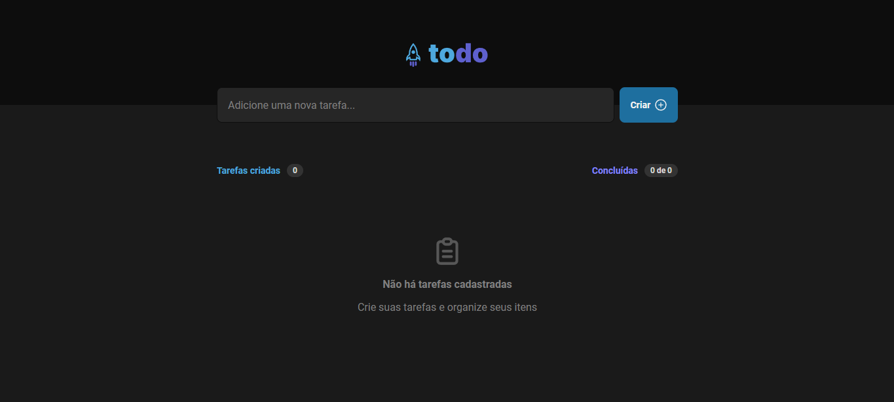

<h1 align="center"> toDo </h1>

Projeto exclusivo, promovido pela Rocketseat para ensino de tecnologias WEB.

  <a href="#-tecnologias">Tecnologias</a>&nbsp;&nbsp;&nbsp;|&nbsp;&nbsp;&nbsp;
  <a href="#-projeto">Projeto</a>&nbsp;&nbsp;&nbsp;|&nbsp;&nbsp;&nbsp;
  <a href="#memo-licença">Licença</a>

  

 

  

## 🚀 Tecnologias

Esse projeto foi desenvolvido com as seguintes tecnologias:

- ReactJS
- TypeScript
- Git e Github

## 💻 Projeto

toDo trata-se de um projeto onde podemos listar nossas obrigações a serem cumpridas, de forma que nada ficará esquecido e sua rotina fique muito mais organizada.

## :memo: Licença

Esse projeto está sob a licença MIT.

---
